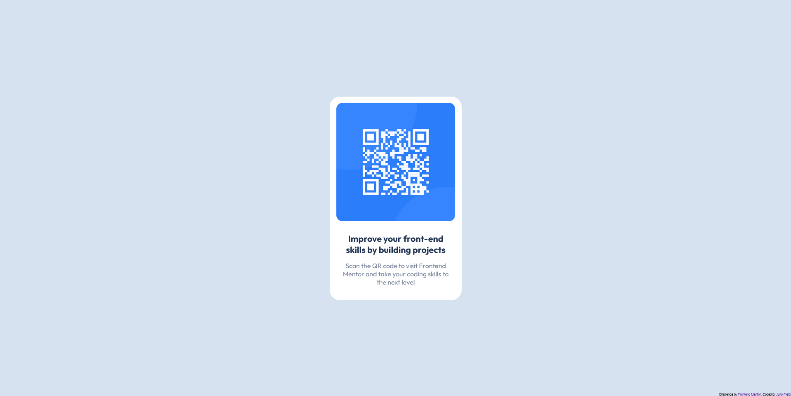

# Frontend Mentor - QR code component solution

This is a solution to the [QR code component challenge on Frontend Mentor](https://www.frontendmentor.io/challenges/qr-code-component-iux_sIO_H). Frontend Mentor challenges help you improve your coding skills by building realistic projects. 

## Table of contents

- [Overview](#overview)
  - [Screenshot](#screenshot)
  - [Links](#links)
- [My process](#my-process)
  - [Built with](#built-with)
  - [Continued development](#continued-development)
  - [Useful resources](#useful-resources)
- [Author](#author)

## Overview

### Screenshot

### Links

- Solution URL: [https://github.com/JunoField/fm2-qr-code-component](https://github.com/JunoField/fm2-qr-code-component)
- Live Site URL: [https://junofield.github.io/fm2-qr-code-component](https://junofield.github.io/fm2-qr-code-component)

## My process

### Built with

- Semantic HTML5 markup
- CSS custom properties
- Mobile-first workflow
- [Parcel](https://parceljs.org/) - A build and test tool for common web dev technologies
- [Node.js](https://nodejs.org/) - Used to support the other dependencies
- [SASS](https://sass-lang.com/) - An extension for CSS adding additional features - not at all necessary for this project, but I like using it regardless.

### Continued development

This is my first attempt at mobile-first development. I will certainly be continuing this workflow, but much more practice and experience will be necessary.

### Useful resources

- [https://blog.hubspot.com/website/center-div-css](https://blog.hubspot.com/website/center-div-css) - This was great with regards to centering the centre card on the screen.

## Author

- GitHub - [@JunoField](https://github.com/JunoField/)
- Frontend Mentor - [@JunoField](https://github.com/JunoField/)

